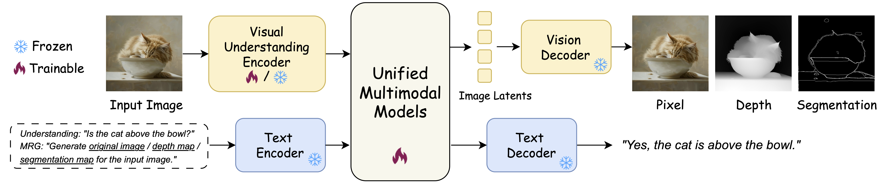

<p align="center">
  <h2 align="center"><strong>Generation Enhances Understanding in Unified Multimodal Models<br> via Multi-Representation Generation</strong></h2>

<p align="center">
  <a href="https://github.com/Sugewud">Zihan Su</a><sup>1,2†*</sup>,
  Hongyang Wei<sup>1*</sup></a>,
  Kangrui Cen<sup>3*</sup></a>,
  Yong Wang<sup>2‡</sup></a>,
  Guanhua Chen<sup>4</sup></a>,<br>
  Chun Yuan<sup>1</sup></a>,
  Xiangxiang Chu<sup>2</sup></a>
</p>

<p align="center">
  <sup>1</sup> Tsinghua University 
  <sup>2</sup> AMAP, Alibaba Group <br>
  <sup>3</sup> Shanghai Jiao Tong University 
  <sup>4</sup> South China University of Technology <br>
  †Work done during internship at AMAP, Alibaba Group *Equal contribution ‡Project leadAuthor
</p>

<div align="center">

<div style="text-align: center;">
  <a href='https://sugewud.github.io/UniMRG-Project/'></a> &nbsp;
  <a href='https://arxiv.org/abs/2601.21406'></a> &nbsp;
  <a href='https://huggingface.co/papers/2601.21406'></a>
  
</div>


</div>

## Release
- [05/25] 🚀 🚀  Code Released! 
- [01/30] Initial Preview Release 🔥 Coming Soon!

## 🔆 Introduction
We propose UniMRG, a simple yet effective architecture-agnostic post-training method for UMMs that leverages generation capabilities to enhance understanding.
<br><br> 

<br><br> 

## 💻 Installation

Our code builds on Harmon. Run the commands below from the `Harmon` directory.

To install requirements:

```bash
conda create -n harmon python=3.10
conda activate harmon
pip install -r requirements.txt
```

## 📋 File Preparation

### Data Preparation

We provide a preprocessed dataset: [LLaVA-Instruct-150K-UniMRG](https://modelscope.cn/datasets/Sugewud/LLaVA-Instruct-150K-UniMRG). Expected layout:

```
data/
├── LLaVA-Instruct-150K/
│   └── llava_v1_5_mix665k.json
│   └── tuning_data
│   └── tuning_data_depth
│   └── tuning_data_mask
```

You can use this preprocessed dataset directly, or build the data yourself with the pipeline below.

Download the LLaVA dataset from [here](https://huggingface.co/datasets/sanaka87/LLaVA-Instruct-150K). Expected layout:

```
data/
├── LLaVA-Instruct-150K/
│   └── llava_v1_5_mix665k.json
│   └── tuning_data/
│       ├── coco/
│       ├── gqa/
│       ├── ocr_vqa/
│       ├── textvqa/
│       └── vg/
```

Clone [Depth-Anything-V2](https://github.com/DepthAnything/Depth-Anything-V2) and run the following command to produce depth maps:

```bash
python run.py \
  --encoder vitl \
  --img-path data/LLaVA-Instruct-150K/tuning_data \
  --outdir data/LLaVA-Instruct-150K/tuning_data_depth \
  --grayscale \
  --pred-only
```

Segmentation masks follow the Segment Anything [automatic_mask_generator](https://github.com/facebookresearch/segment-anything/blob/main/notebooks/automatic_mask_generator_example.ipynb). Clone the original repository, copy `segment-anything/run_mask.py` from this repo into the root of that clone, then run:

```bash
python run_mask.py \
  --img-path data/LLaVA-Instruct-150K/tuning_data \
  --outdir data/LLaVA-Instruct-150K/tuning_data_mask \
  --checkpoint sam_vit_h_4b8939.pth \
  --model-type vit_h \
  --pred-only
```


### Model Preparation

Download the pre-trained Harmon model:

```bash
# Create checkpoints directory
mkdir -p checkpoints

# Download via Hugging Face CLI (recommended)
pip install -U "huggingface_hub[cli]"
huggingface-cli download wusize/harmon --local-dir checkpoints --repo-type model
```

Your checkpoint structure should look like:

```
checkpoints/
├── kl16.ckpt
├── harmon_0.5b.pth
├── harmon_1.5b.pth
└── ...
```

## 🐶 Training

Configure the training environment from `configs/examples/UniMRG` and set GPU from `train.sh`.

Start the training process:

```bash
bash train.sh
```

Checkpoints are saved in:

```
work_dirs/UniMRG/
├── iter_500.pth
├── iter_1000.pth
└── ...
```


## 🚀 Evaluation


### Visualization

Use the script below to visualize outputs from the Harmon model. Set `--mode` to `pixel`, `depth`, or `segmentation`.

```bash
# Base model checkpoint — predict depth
python scripts/visualization.py \
    --input_image 'assets/image.jpg' \
    --checkpoint 'checkpoints/harmon_1.5b.pth' \
    --mode depth

# Fine-tuned checkpoint — predict depth
python scripts/visualization.py \
    --input_image 'assets/image.jpg' \
    --checkpoint 'work_dirs/UniMRG/iter_4000.pth' \
    --mode depth
```

### GenEval

```bash
# GenEval evaluation
export PYTHONPATH=.
torchrun \
  --nnodes 1 \
  --node_rank 0 \
  --nproc-per-node 8 \
  --master_addr 127.0.0.1 \
  --master-port 12345 \
  scripts/parallel_geneval.py \
  --checkpoint checkpoints/harmon_1.5b.pth \
  --batch_size 12 \
  --outdir "results/UniMRG_gen" \
  --mode geneval \
  --image_size 512 \
  --validation_prompts_file ../Benchmark/geneval/evaluation_metadata.jsonl
```

For score computation, see [GenEval](https://github.com/HorizonWind2004/reconstruction-alignment/blob/main/Benchmark/README.md#geneval).

### DPGBench

```bash
# DPGBench evaluation
export PYTHONPATH=.
torchrun \
  --nnodes 1 \
  --node_rank 0 \
  --nproc-per-node 8 \
  --master_addr 127.0.0.1 \
  --master-port 12345 \
  scripts/parallel_geneval.py \
  --checkpoint checkpoints/harmon_1.5b.pth \
  --batch_size 4 \
  --outdir "results/UniMRG_dpg" \
  --mode dpgbench \
  --image_size 512 \
  --prompts_file ../Benchmark/dpgbench/prompts.json
```

For score computation, see [DPGBench](https://github.com/HorizonWind2004/reconstruction-alignment/blob/main/Benchmark/README.md#dpgbench).

### Understanding

Understanding benchmarks follow [VLMEvalKit](https://github.com/open-compass/VLMEvalKit). Clone the repository.
```bash
git clone https://github.com/open-compass/VLMEvalKit.git
cd VLMEvalKit
```

The current VLMEvalKit release does not support Harmon. Apply the following changes:

1. Copy `vlmeval/vlm/harmon.py` from this repo to the same path in VLMEvalKit (defines Harmon model inference).
2. Replace VLMEvalKit's `vlmeval/vlm/__init__.py` with ours. The only change is adding `from .harmon import Harmon`.
3. Replace VLMEvalKit's `vlmeval/config.py` with ours. The only changes are defining `harmon_series` and registering it in `model_groups`.

Default `harmon_series`:

```python
harmon_series = {
    "Harmon": partial(
        Harmon,
        model_path="Harmon/configs/models/qwen2_5_1_5b_kl16_mar_h.py",
        checkpoint_path="Harmon/checkpoints/harmon_1.5b.pth",
    ),
}
```

You can edit `checkpoint_path` to evaluate other checkpoints. Then run:

```bash
cd VLMEvalKit
python run.py \
  --data MMBench_DEV_EN MMVP HallusionBench RealWorldQA VSR-zeroshot \
  --model Harmon \
  --work-dir ./outputs
```

## 🙌🏻 Acknowledgement
Our code is based on these awesome repos:
* [RecA](https://github.com/HorizonWind2004/reconstruction-alignment)
* [Harmon](https://github.com/wusize/Harmon)


## 📖 BibTeX
If you find our repo helpful, please consider leaving a star or cite our paper :)
```bibtex
@article{su2026generation,
  title={Generation Enhances Understanding in Unified Multimodal Models via Multi-Representation Generation},
  author={Su, Zihan and Wei, Hongyang and Cen, Kangrui and Wang, Yong and Chen, Guanhua and Yuan, Chun and Chu, Xiangxiang},
  journal={arXiv preprint arXiv:2601.21406},
  year={2026}
}
```
